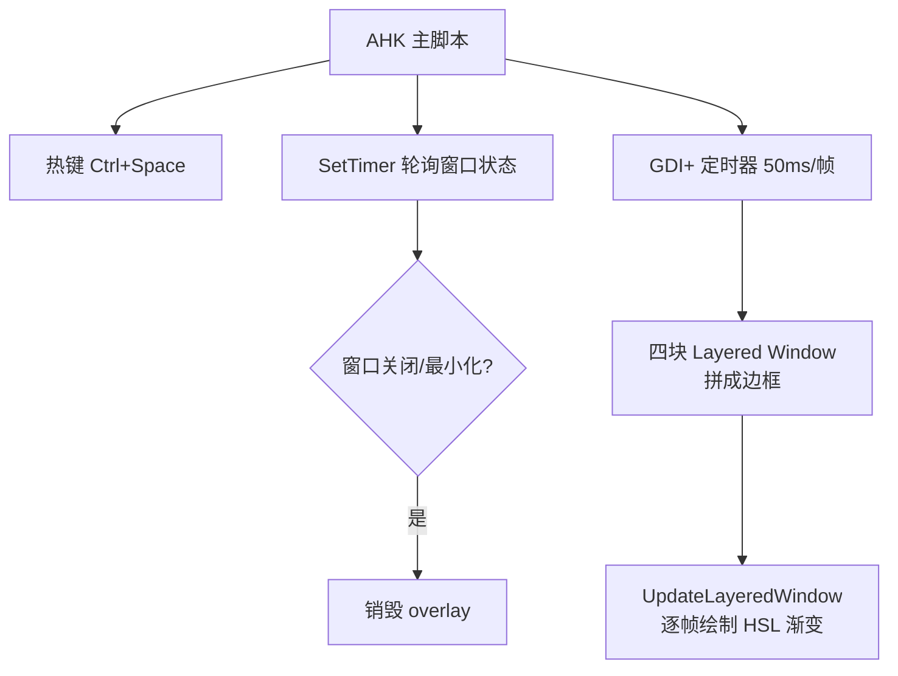

给窗口加一个"钉住"功能：按 Ctrl+Space 把当前窗口置顶，同时绘制一圈流动的彩虹边框做视觉标记。用 AutoHotkey v2 + GDI+ 实现，不需要依赖任何外部工具。

<!-- more -->

## 三层架构



| 层 | 角色 |
|---|------|
| 主脚本 | 热键监听、窗口状态追踪、SetTimer 驱动 |
| DLL Hook（可选） | 拦截 `WM_INITMENUPOPUP`，注入"Toggle Always on Top"到系统菜单 |
| GDI+ Layered Windows | 四块 `WS_EX_LAYERED` 子窗口，逐帧绘制彩虹渐变边框 |

## 彩虹流动动画

核心是 HSL 色相轮转：

```autohotkey
global RAINBOW_SPEED := 3      ; 每帧滚动 3°
global RAINBOW_SPAN  := 360    ; 四条边总色相跨度

AnimateRainbow() {
    HUE_OFFSET := Mod(HUE_OFFSET + RAINBOW_SPEED, 360)
    RedrawOverlays()  ; 按当前 hue offset 重绘四条边
}
```

每条边画一个 HSL 线性渐变。四条边首尾色相衔接，定时器 `SetTimer(AnimateRainbow, 50)` 每 50ms 推一帧，色相偏移 3°，形成顺时针流动效果。

## DLL Hook 是可选的

DLL 只做一件事：让**点击系统菜单**能触发切换。所有其他功能不依赖 DLL：

| 功能 | 需要 DLL？ |
|------|-----------|
| 彩虹边框显示 | ❌ 纯 GDI+ |
| Ctrl+Space 热键 | ❌ AHK 原生 |
| 窗口关闭自动清理 | ❌ SetTimer 轮询 |
| 状态持久化（重启后恢复） | ❌ SetPropW/GetPropW |
| 系统菜单点击切换 | ✅ 需要 Hook DLL |

如果不需要系统菜单交互，删掉 `LoadLibrary`、`InstallHook`、`OnMessage(WM_TOGGLE, ...)` 这几行即可，其他功能不受影响。替代方案：托盘菜单 `A_TrayMenu.Add()` 或双击标题栏触发。

## GDI+ 的 Mask 层

`mask.ahk` 实现了叠加层的基础设施：

```autohotkey
global pToken := gdip_Startup()
; 创建 layered window
g := Gui("+AlwaysOnTop -Caption +ToolWindow +E0x80000 +E0x20")
g.BackColor := color
g.Show("W" w " H" h " X" x " Y" y " NA")
WinSetTransparent(alpha, g.Hwnd)
```

`WS_EX_LAYERED`（`+E0x80000`）让窗口走 DWM 合成管线，每个显示器只占约 5MB 内存。创建后没有循环、没有定时器——渲染由 Windows DWM 硬件加速处理。

## GDI+ vs D3D

有人问过换 D3D 是不是更好。对比：

| | GDI+（当前） | D3D Hook |
|---|---|---|
| CPU | <0.1% | 0.5-2% |
| GPU | <1% | 5-15% |
| 每帧开销 | 无（DWM 合成） | 每次 Present 调用 |
| 游戏影响 | 无 | 5-15% 性能损失 |
| 反作弊风险 | 无 | 高（VAC/EAC/BattlEye）|
| 蓝屏风险 | 无 | 非零 |

GDI+ 画 4 个小矩形（边长 ≤ 2000px），每 50ms 一帧，CPU 单核占用 <1%。D3D Hook 需要在游戏渲染循环的每一帧插入绘制，144Hz 就是每秒 144 次 GPU 操作——工程复杂度翻 3 倍，收益几乎为零。

---

> 本文基于与 DeepSeek 的一次对话整理，原始对话：https://chat.deepseek.com/share/fwgdrmb324yc1xa0v4
