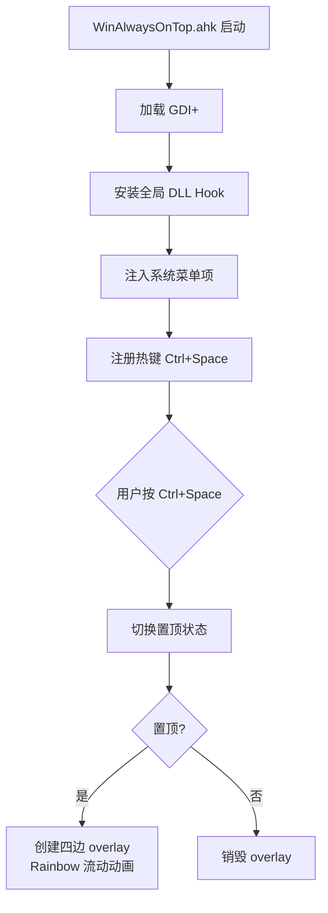

Windows 上缺三个 macOS 习以为常的操作：Cmd+` 同应用窗口切换、窗口置顶带视觉反馈、任意位置拖拽窗口。AutoHotkey v2 + GDI+ 可以补上。

<!-- more -->

## 同应用窗口切换（Cmd+`）

核心逻辑很短：

```autohotkey
#`::SwitchToSimilarWindow()

SwitchToSimilarWindow() {
    MouseGetPos(, , &mouse_id)
    mouse_class := WinGetClass("ahk_id " mouse_id)
    mouse_exe := WinGetProcessName("ahk_id " mouse_id)

    ids := [], titles := []
    for this_id in WinGetList(, , "Program Manager") {
        if (WinGetClass("ahk_id " this_id) = mouse_class
         && WinGetProcessName("ahk_id " this_id) = mouse_exe) {
            ids.Push(this_id)
            titles.Push(WinGetTitle("ahk_id " this_id))
        }
    }
    index := ShowToolTip(mouse_exe, mouse_class, titles)

    key := RegExReplace(A_ThisHotKey, "[*~$#+!^( UP)]")
    Loop {
        if !GetKeyState("LWin", "P") {
            WinActivate("ahk_id " ids[index])
            ToolTip()
            break
        }
        KeyWait(key)
        if KeyWait(key, "D T0.2")
            index := ShowToolTip(mouse_exe, mouse_class, titles, index)
    }
}
```

用 `WinGetClass` + `WinGetProcessName` 双重匹配识别同一应用，比 Alt+Tab 精准——只切 Chrome 就只看 Chrome，不受其他窗口干扰。按住 Win 键不放，0.2 秒内连续按热键在窗口列表中切换，松开即激活。

## 窗口置顶 + 彩虹边框

AHK v2 实现。用 GDI+ 在目标窗口上覆盖四层半透明 layered window 组成彩虹流动边框。



三层架构：

| 层 | 角色 |
|---|------|
| AHK 主脚本 | 热键监听、窗口状态管理、GDI+ 绘制定时器 |
| DLL Hook (`SetWindowsHookEx`) | 拦截 `WM_INITMENUPOPUP`，注入"Toggle Always on Top"菜单项到每个窗口的系统菜单 |
| GDI+ Layered Windows | 四块半透明 `WS_EX_LAYERED` 子窗口，用 `UpdateLayeredWindow` 逐帧绘制彩虹渐变边框 |

DLL 不是必须的——没有 DLL 时标题栏右键菜单不会有"Toggle"选项，但彩虹边框和 Ctrl+Space 热键照样工作。Hook DLL 的好处是无侵入：不需要修改目标进程，不注入代码到目标窗口，只是拦截全局消息。

### 彩虹流动的实现

```autohotkey
global HUE_OFFSET := 0
global RAINBOW_SPAN  := 360    ; 边框上的总色相跨度
global RAINBOW_SPEED := 3      ; 每帧滚动度数

AnimateRainbow() {
    HUE_OFFSET := Mod(HUE_OFFSET + RAINBOW_SPEED, 360)
    ; 为每条边重绘：起点色相 = HUE_OFFSET，终点色相按 RAINBOW_SPAN 分布
    RedrawOverlays()
}
```

每条边画一个 HSL 渐变，四条边首尾相连组成闭环，定时器每 50ms 推一帧。纯 CPU 渲染——`UpdateLayeredWindow` 走 GDI+ 软件管线，不涉及 D3D。

### GDI+ vs D3D

有人问了资源占用对比。结论：

- GDI+ 方案画 4 个小矩形 ≤ 200×2000 像素，每 50ms 一帧，CPU 单核占用 < 1%
- 换 D3D 需要创建 swap chain、管理 device context、处理 lost device 恢复——工程复杂度翻 3 倍，收益几乎为零
- 不上 D3D 不是因为不能，是没必要

mask.ahk 实现了 GDI+ 裸层：`gdip_Startup()` → 创建 `Gui` + `WS_EX_LAYERED` → `UpdateLayeredWindow` 画位图。这是所有 overlay 效果的基座。

## 拖拽移动 + 边缘吸附 + 点击最大化

用 `LButton & RButton` 组合热键实现：左键按住不放 + 右键 → 进入拖拽模式。

```autohotkey
LButton & RButton::
{
    MouseGetPos &ox, &oy
    hwnd := WinExist("A")
    WinGetPos &wx, &wy, &ww, &wh, "ahk_id " hwnd
    moved := false

    Loop {
        if !GetKeyState("LButton", "P") {
            break
        }
        MouseGetPos &cx, &cy
        if (Abs(cx - ox) > 3 || Abs(cy - oy) > 3) {
            moved := true
            WinMove cx - ox + wx, cy - oy + wy, , , "ahk_id " hwnd
            ; 接近边缘时显示吸附提示
            if (cx < 20 || cx + ww > A_ScreenWidth - 20
             || cy < 20 || cy + wh > A_ScreenHeight - 20)
                ToolTip "吸附中..."
        }
        Sleep 10
    }

    if moved {
        ; 吸附到最近边缘
        ; 计算四个方向的最小距离，WinMove 贴边
    } else {
        ; 点击未移动 → 最大化/还原
        WinMaximize "ahk_id " hwnd
    }
}
```

关键点：`LButton & RButton` 用 `~LButton` 前缀保留左键的正常点击功能，拖拽阈值设为 3px 区分点击和拖拽。

## 踩过的坑

这个对话本质是 6 轮迭代修 bug：

**坑 1：`OnMessage` 吞掉鼠标事件。** 在 `WinMove` 中用 `OnMessage(0x0201, ...)` 拦截 `WM_LBUTTONDOWN` 导致所有左键点击失效。根本原因：AHK 的 `OnMessage` 注册的是全局钩子，`return 0` 会阻止消息继续传递。解法是用 `LButton & RButton` 组合热键替代 `OnMessage`，完全绕开消息拦截。

**坑 2：语法错误 `Missing "propertyname:" in object literal`。** AHK v2 的 `{key: value}` 写法只在特定上下文生效（如 `Map()` 参数），其他地方必须写 `{key: value}`。这是 v1 → v2 最常见的绊脚石。

**坑 3：`Return` 导致死代码。** 在循环体里提前 `return` 后还写了后续逻辑，AHK v2 的静态分析器比较严格。

**坑 4：`SetTimer` 回调签名。** v2 的 `SetTimer(FuncObj, period)` 不再传字符串函数名，回调函数签名必须是 `FuncName()` 无参——如果需要在回调里访问主脚本变量，得用闭包或者全局变量。

**坑 5：连续版本的累积状态**。一个脚本迭代了 5 版以上，旧的中断逻辑和新的热键处理互相覆盖。解决方式是每次大改直接重写，而不是在已有代码上叠补丁。

核心教训：AHK v2 的 API 表面直观，但事件模型（热键 vs OnMessage vs SetTimer）的交互行为需要运行时验证。涉及鼠标拦截的场景，优先用组合热键而不是消息钩子。

---

> 本文基于与 DeepSeek 的一次对话整理，原始对话：https://chat.deepseek.com/share/fwgdrmb324yc1xa0v4
