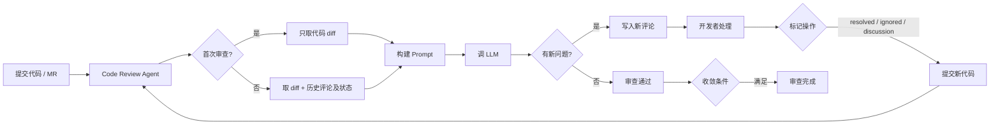

无状态的 AI 代码审查有两个毛病：一是随机性——同一段代码每轮反馈不一样；二是无收敛——按意见改完后下一轮又冒出新问题，无穷无尽。两者源于同一个事实：每轮审查都是「失忆」的，既不知道上次说过什么，也没有「审到什么时候算完」的边界。

## 根因

随机性来自 LLM 采样（temperature > 0）+ 上下文每次独立 + prompt 缺锚定；无收敛来自修改引入新问题 + AI 的完美主义倾向（总能找到可优化的点）+ 缺优先级和收敛条件。

## 核心思路

把「每次重新审查」改成「增量式审查」：**用 Git 评审系统当状态存储**。Agent 本身仍然无状态，但每轮都把「代码 diff + 历史评论及解决状态」一起塞给模型，让它知道什么已经处理过、不用再提。开发者对评论的标记操作（resolved / ignored / discussion）天然就是给模型的反馈信号。



## 单轮全上下文，不要拆多轮

把 diff + 历史评论及状态一次性给模型，比分多轮（第一轮给 diff、第二轮给历史过滤）更合理：

- LLM 擅长处理完整上下文，不擅长跨轮次状态管理；
- 多轮 API 调用会累积随机性误差；
- 一次调用里模型能交叉验证「这个问题真的修了吗、修复有没有引入新问题」，收敛判断更自然；
- 工程上不用维护多阶段状态机。

唯一代价是 prompt 长度，靠截断策略控制。

## Prompt 结构

```text
[System]     审查规则 + 收敛条件
[代码 diff]   当前待审查的变更
[历史评论]    resolved / ignored / discussion / open 及开发者回复
[输出要求]   JSON：verified_fixed / still_exists / new_issues / convergence
```

输出 JSON 示例：

```json
{
  "resolved_issues":   [{"comment_id": "c1", "verified": true}],
  "still_exists":      [{"comment_id": "c2", "current_status": "..."}],
  "new_issues":        [{"severity": "major", "file": "a.py", "line": 45}],
  "can_converge":      false
}
```

关键规则写进 prompt：不要重复报告历史评论里已有记录的问题；开发者明确 won't fix 的，除非是严重安全问题否则接受；连续两轮只剩风格类问题就停止。

## 收敛条件

任一条满足即收敛：

- 所有历史问题都已 resolved 或 ignored，且本轮无新问题；
- 达到最大审查轮次（如 3 轮）；
- 剩余问题全为已标记 ignored；
- 连续两轮无新问题。

## 上下文过滤策略

评论历史会随 MR 生命周期变长，不截断既烧 token 又会被几百条旧评论淹没当前重点，还会踩到代码漂移——旧评论指向的行号早已不存在。一个务实的三板斧：

1. **未解决评论阻断**：存在 unresolved 评论时直接不评审，反馈「先解决现有评论」。强制开发者先消化旧问题，从根上阻止问题堆积。
2. **已解决评论滑窗**：只取最近 30%、且最多 50 条，聚焦最近变更，避免代码漂移导致历史评论失真。
3. **剩余历史聚合**：更早的已解决/已忽略评论压成一句统计摘要（「已解决 12 条，涉及 3 个文件」），让模型知道「这些处理过了、不用再提」即可。

截断优先级：未解决 > 最近已解决 > 已忽略（只留统计摘要）。

## 备忘

- 问题去重 ID 用「类型 + 文件 + 行号」做 key，别用描述文字，否则同一问题换个说法就被判成新的。
- 收敛的核心不是模型参数，是应用层业务逻辑——「审到什么程度算完」是代码决定的，不是采样决定的。
- 风格/命名/格式类问题交给 linter，AI 只盯安全、逻辑、数据风险，能少一大半无效输出。

---

> 本文基于与 DeepSeek 的一次对话整理，原始对话：<https://chat.deepseek.com/share/r2v6m0g555300o26cv>
