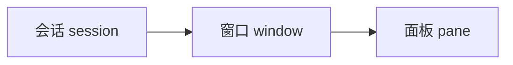

tmux 是终端复用器（terminal multiplexer）：一个终端里开多个会话 / 窗口 / 面板，断线重连后进程照跑。SSH 到服务器跑长任务、或本地想并行开几个终端时最常用。

前缀键默认 `Ctrl+b`，下文写成 `<C-b>`。所有操作 = 先按 `<C-b>`，再按功能键（两次按键之间不用松开 Ctrl）。

## 核心模型



- 会话在后台存活，attach / detach 进出，进程照跑。
- 一个会话可开多个窗口；一个窗口可再分多个面板。
- 关掉终端窗口不影响 tmux 会话。

## 会话

| 操作 | 按键 / 命令 |
|------|------------|
| 新建并进入（`-s` 指定名字） | `tmux new -s <名字>` |
| 列出所有会话 | `tmux ls` |
| 进入（恢复）指定会话 | `tmux attach -t <名字>` |
| 退出（detach，进程继续跑） | `<C-b> d` |
| 更名当前会话 | `<C-b> $` |
| 杀掉指定会话 | `tmux kill-session -t <名字>` |
| 杀掉全部会话 | `tmux kill-server` |

## 窗口

| 操作 | 按键 |
|------|------|
| 新开窗口 | `<C-b> c` |
| 下一个 / 上一个窗口 | `<C-b> n` / `<C-b> p` |
| 更名当前窗口 | `<C-b> ,` |

## 面板（分屏）

| 操作 | 按键 |
|------|------|
| 水平分屏（上 / 下） | `<C-b> "` |
| 垂直分屏（左 / 右） | `<C-b> %` |
| 切换面板 | `<C-b> 方向键`，或 `<C-b> o` 轮流跳 |
| 关闭当前面板 | 面板内 `exit` 或 `<C-d>` |

## 调整大小

| 操作 | 按键 |
|------|------|
| 向某方向扩 / 缩 1 格 | `<C-b> <C-方向键>` |
| 一次扩 / 缩 5 格（快） | `<C-b> Alt+方向键` |
| 放大 / 还原当前面板（开关） | `<C-b> z` |

精确到格子数：`<C-b> :` 进入命令提示符后输入：

```bash
resize-pane -R 20  # 往右扩 20 格（-L 左 / -R 右 / -U 上 / -D 下）
resize-pane -D 10  # 往下扩 10 格
resize-pane -x 80  # 直接指定宽度（列数）
resize-pane -y 30  # 直接指定高度（行数）
```

## 滚动与复制

| 操作 | 按键 |
|------|------|
| 进入复制模式（滚动看日志） | `<C-b> [` |
| 翻页 | `PgUp` / `PgDn` |
| 退出复制模式 | `q` |
