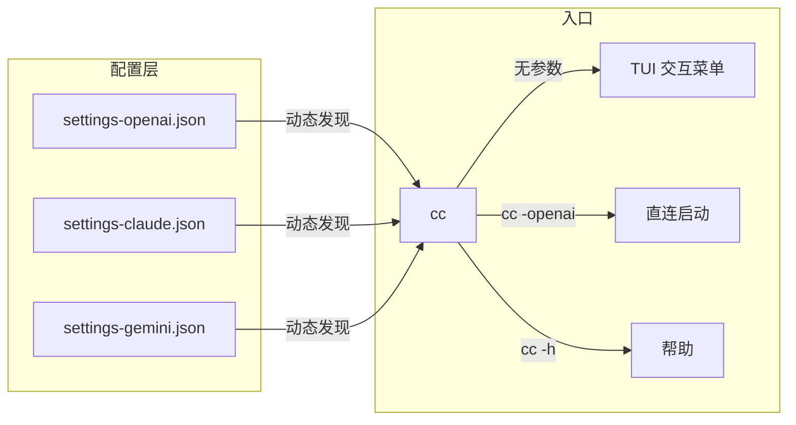

给 Claude Code 配置多个后端（OpenAI、Anthropic、Gemini 等）之后，每次切换都要手动指定 `--settings` 路径——麻烦而且容易搞混 API key。这个脚本用"文件系统约定替代硬编码配置"的思路，把多后端管理压缩成一个 `cc` 命令。

## 架构



核心规则：在 `~/.claude/` 下放 `settings-<name>.json` 文件，文件名里的 `<name>` 自动成为子命令。新增后端只需放文件，脚本零改动。

## 三种启动模式

**TUI 交互（无参数）**——最常用的日常入口：

```bash
cc
```

显示可用的后端列表，方向键移动高亮，Enter 确认，数字键直选，q 退出。ANSI 转义码实现，不需要 ncurses 依赖。

**命令行直选**——适合脚本化和快速切换：

```bash
cc -openai "帮我 review 这段代码"
cc -claude --resume
```

`-` 后的名称直接映射到 `~/.claude/settings-<name>.json`，剩余参数透传给 Claude Code。

**帮助**：

```bash
cc -h
```

## 关键实现细节

### 环境变量隔离

```bash
exec env \
  -u ANTHROPIC_API_KEY \
  -u ANTHROPIC_AUTH_TOKEN \
  -u ANTHROPIC_BASE_URL \
  -u ANTHROPIC_MODEL \
  -u ANTHROPIC_SMALL_FAST_MODEL \
  "$HOME/.local/bin/claude" \
  --settings "$file" \
  ...
```

用 `env -u` 而不是直接 `unset` 的原因是 `exec` 替换了当前进程——`unset` 在子 shell 里会影响父 shell 的状态，而 `env -u` 只在 exec 继承的环境里生效。这解决了 `.bashrc` 里 export 的残留 API key 与 settings 文件里的 token 冲突问题。

### TUI 的终端控制

```bash
# 保存当前终端设置
saved_stty=$(stty -g 2>/dev/null)
# 切换到 raw 模式：不回显，逐字符读取，不等回车
stty -echo -icanon min 1 time 0 2>/dev/null

cleanup() {
  stty "$saved_stty" 2>/dev/null || stty sane 2>/dev/null
  echo ""
}
trap 'cleanup; exit 0' INT
```

`stty -g` 保存的是终端驱动参数的完整快照，`cleanup` 确保无论怎么退出（正常选完、Ctrl+C、异常），终端状态都能恢复。`min 1 time 0` 的意思是"有 1 个字符就立即返回，不等"——这就是方向键可以实时响应的原因。

方向键检测靠 ANSI escape 序列：`ESC[A` = 上，`ESC[B` = 下。`xterm` 兼容的终端还支持 `ESC OA` / `ESC OB` 的变体。

### 菜单刷新

```bash
draw_menu() {
  [ "$1" != "first" ] && printf '\033[%dA' "$menu_lines"
  printf '\033[1;34m...\033[0m\n\n'
  ...
}
```

不是清屏重绘，而是用 `\033[nA`（光标上移 n 行）回到菜单顶部，覆盖式重绘。没有闪烁，体感流畅。

## 设计取舍

**文件系统作为配置注册表**。替代方案是用一个 `config.toml` 列出所有后端，但文件系统约定更简单：不需要解析、不需要 schema、不需要加新后端时编辑同一个文件（减少 merge conflict 的可能性）。代价是文件多了之后 `ls` 看起来乱——对这个场景来说，一个用户通常只有 3-5 个后端，可以接受。

**不检查 settings JSON 有效性**。脚本只检查文件是否存在，不解析 JSON 内容。理由是 Claude Code 启动时自己会校验并给出清晰的报错，在入口脚本里重复校验只会增加维护负担。

**用 exec 而不是 fork+wait**。`launch()` 里直接 `exec`，意味着 bash 进程被 Claude Code 替换。好处是不残留一个无用的 bash 父进程；坏处是启动后无法在脚本里做后续处理。对于入口脚本来说这是正确的取舍——启动后本来也不需要再做什么。

---

> 本文基于与 DeepSeek 的一次对话整理，原始对话：https://chat.deepseek.com/share/fsssyz20rj8k0fsnno
