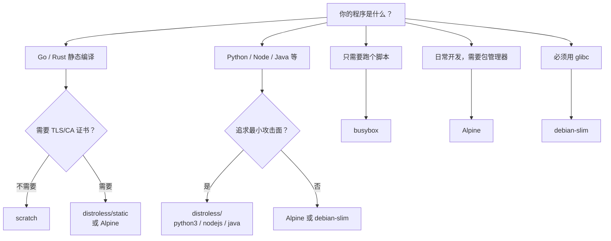

容器镜像越小越好——这话没错，但「小」到什么程度合适？scratch、distroless、busybox、Alpine、debian-slim 一字排开，体积从 0MB 到 100MB，选错一个可能让线上排障变成噩梦。这篇文章把主流的几个极小镜像掰开揉碎了讲清楚。

## 一张表看全貌

| 镜像 | 大小 | 包含内容 | Shell | 包管理器 |
|------|------|---------|:---:|:---:|
| scratch | 0 MB | 什么都没有 | ❌ | ❌ |
| distroless/static | ~2-5 MB | glibc/musl C 运行时库 | ❌ | ❌ |
| busybox | ~1-2 MB | 基本命令集（ls/cat/cp…） | ✅ | ❌ |
| Alpine | ~5-8 MB | musl + busybox + apk | ✅ | ✅ |
| debian-slim | ~30-80 MB | 精简版 glibc + apt | ✅ | ✅ |
| ubuntu | ~80-100 MB | 完整系统 | ✅ | ✅ |

有趣的是 **busybox（~1-2MB）比 distroless（~2-5MB）更小**。原因是 busybox 把所有工具静态编译进一个二进制，不依赖外部 C 库；distroless 却要带一整套 C 运行时——所以体积反而不如 busybox「小」。

## 逐个拆解

### 1. scratch — 真正的「零」

什么都没有，连 Shell 都不存在。**只适合 Go/Rust 这类静态编译的语言**。

```dockerfile
FROM scratch
COPY myapp /myapp
ENTRYPOINT ["/myapp"]
```

Go 静态编译的关键：

```bash
CGO_ENABLED=0 go build -o myapp .
```

`CGO_ENABLED=0` 切断 C 库依赖后，Go 运行时（GC、协程调度、标准库）全部内嵌在二进制里，镜像大小 = 你的程序大小，基础层为零。

同理，Rust 用 musl target：

```bash
rustup target add x86_64-unknown-linux-musl
cargo build --target x86_64-unknown-linux-musl --release
```

**踩坑预警**：scratch 没有 `/etc/resolv.conf` 和 CA 证书，如果程序需要发 HTTPS 请求或做 DNS 解析，要么手动 COPY 这些文件，要么换 distroless 或 Alpine。

### 2. distroless — Google 的安全方案

Google 出品，理念是「只给你运行时，别的不给」——没有 Shell、没有包管理器、没有任何调试工具。攻击面最小。

distroless 是一个镜像系列，按语言细分：

| 镜像 | 大小 | 说明 |
|------|------|------|
| `gcr.io/distroless/static` | ~2-5 MB | 纯静态程序 |
| `gcr.io/distroless/base` | ~15 MB | 含 glibc |
| `gcr.io/distroless/nodejs` | ~100 MB | Node.js 运行时 |
| `gcr.io/distroless/python3` | ~60 MB | Python 解释器 |
| `gcr.io/distroless/java` | ~150 MB | Java JRE |

Node.js 示例：

```dockerfile
FROM node:20-alpine AS builder
WORKDIR /app
COPY package*.json ./
RUN npm ci --production
COPY . .
RUN npm run build

FROM gcr.io/distroless/nodejs20
WORKDIR /app
COPY --from=builder /app/dist ./dist
COPY --from=builder /app/node_modules ./node_modules
COPY --from=builder /app/package.json .
CMD ["server.js"]
```

**核心取舍**：没有 Shell → `kubectl exec -it` 进不去。这是设计选择——用不可调试换最小攻击面。建议 CI 里同时维护一个 Alpine 版 debug 镜像备用。

### 3. busybox — 瑞士军刀

所有命令（ls、cat、cp、mv、sh…）编译进一个二进制，整个镜像只有 ~1-2MB。有 Shell 但没包管理器。

**典型场景**：
- K8s init 容器跑初始化脚本
- sidecar 做日志轮转
- 网络诊断工具容器（`kubectl run debug --image=busybox --rm -it -- sh`）

```dockerfile
FROM busybox
COPY entrypoint.sh /entrypoint.sh
ENTRYPOINT ["sh", "/entrypoint.sh"]
```

### 4. Alpine — 开发者的最爱

musl libc + busybox + apk 包管理器，~5-8MB。兼顾了「小」和「方便」，日常开发首选。

```dockerfile
FROM alpine
RUN apk add --no-cache curl ca-certificates
COPY myapp /myapp
ENTRYPOINT ["/myapp"]
```

多阶段构建是 Alpine 的经典用法——编译用完整镜像，运行用 Alpine：

```dockerfile
FROM golang:1.22 AS builder
WORKDIR /app
COPY . .
RUN CGO_ENABLED=0 go build -o myapp .

FROM alpine
RUN apk add --no-cache ca-certificates
COPY --from=builder /app/myapp /myapp
ENTRYPOINT ["/myapp"]
```

**musl vs glibc 暗坑**：Alpine 用 musl 而非 glibc，大部分场景没问题，但可能遇到：
- DNS 解析行为差异
- 某些 Python C 扩展编译失败（wheel 按 glibc 编译）
- 依赖 glibc 特有 API 的闭源软件

### 5. debian-slim — 兼容性兜底

精简版 glibc + apt 包管理器，~30-80MB。体积最大，但**兼容性问题最少**——当 Alpine 的 musl 引发诡异 bug 时，debian-slim 是安全牌。

```dockerfile
FROM python:3.11-slim
COPY requirements.txt .
RUN pip install -r requirements.txt
COPY app.py .
ENTRYPOINT ["python", "app.py"]
```

## 选型决策树



## 能力和库的全面对比

| 能力 | scratch | distroless | busybox | Alpine | debian-slim |
|------|:---:|:---:|:---:|:---:|:---:|
| C 运行时库 | ❌ | ✅ | ❌ | ✅ musl | ✅ glibc |
| Shell | ❌ | ❌ | ✅ ash | ✅ ash | ✅ bash |
| 基本命令 | ❌ | ❌ | ✅ | ✅ | ✅ |
| 包管理器 | ❌ | ❌ | ❌ | ✅ apk | ✅ apt |
| TLS/CA 证书 | ❌ | ✅ | ❌ | ✅ | ✅ |
| 时区数据 | ❌ | ✅ | ❌ | ✅ | ✅ |
| 调试能力 | ❌ | ❌ | ✅ | ✅ | ✅ |

## 一句话总结

| 场景 | 推荐 |
|------|------|
| Go/Rust 静态程序 | scratch |
| 需要系统库 + 追求安全 | distroless |
| 需要 Shell 跑脚本 | busybox |
| 日常开发，要包管理器 | Alpine |
| 需要 glibc 兼容性 | debian-slim |

选镜像不是比谁的体积数字小——是在**安全、兼容、调试便利**之间找到一个适合你项目的三角平衡点。

---

> 本文整理自 [许森林：极小容器镜像选型指南——从 scratch 到 Alpine](https://xusenlin.com/article?key=CUZT84)
