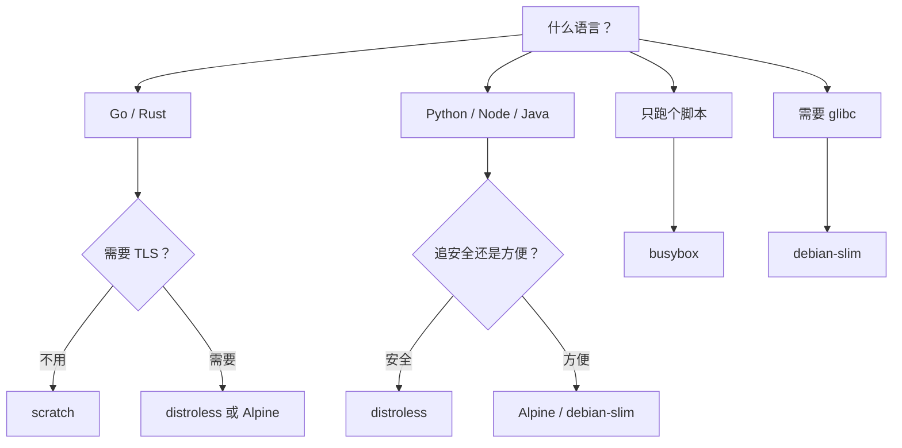

几种极小镜像的对比，做个备忘。

## 体积对比

| 镜像 | 大小 | 有什么 | Shell | 包管理器 |
|------|------|---------|:---:|:---:|
| scratch | 0 MB | 空 | ❌ | ❌ |
| distroless/static | ~2-5 MB | glibc 或 musl | ❌ | ❌ |
| busybox | ~1-2 MB | ls/cat/cp/sh…全打包成一个二进制 | ✅ | ❌ |
| Alpine | ~5-8 MB | musl + busybox + apk | ✅ | ✅ |
| debian-slim | ~30-80 MB | 精简 glibc + apt | ✅ | ✅ |
| ubuntu | ~80-100 MB | 完整系统 | ✅ | ✅ |

busybox 比 distroless 还小，因为 busybox 是纯静态编译，distroless 带了整个 C 运行时库。

## scratch

空镜像，连 Shell 都没有。Go/Rust 静态编译专用。

```dockerfile
FROM scratch
COPY myapp /myapp
ENTRYPOINT ["/myapp"]
```

```bash
CGO_ENABLED=0 go build -o myapp .
```

镜像大小就是二进制大小。Rust 同理，用 musl target 编译就行。

坑：没有 `/etc/resolv.conf` 和 CA 证书，发 HTTPS 或做 DNS 需要手动 COPY 这些文件，或者换 distroless/Alpine。

## distroless

Google 的方案：只给运行时，其他什么都没有。没有 Shell，`kubectl exec -it` 进不去——这是故意的，攻击面最小。

按语言分了好几个变体：

| 镜像 | 大小 | 说明 |
|------|------|------|
| `gcr.io/distroless/static` | ~2-5 MB | 纯静态 |
| `gcr.io/distroless/base` | ~15 MB | 带 glibc |
| `gcr.io/distroless/nodejs` | ~100 MB | Node.js |
| `gcr.io/distroless/python3` | ~60 MB | Python |
| `gcr.io/distroless/java` | ~150 MB | Java |

```dockerfile
# 多阶段：alpine 编译，distroless 运行
FROM node:20-alpine AS builder
WORKDIR /app
COPY package*.json ./
RUN npm ci --production
COPY . .
RUN npm run build

FROM gcr.io/distroless/nodejs20
WORKDIR /app
COPY --from=builder /app/dist ./dist
COPY --from=builder /app/node_modules ./node_modules
COPY --from=builder /app/package.json .
CMD ["server.js"]
```

线上用 distroless，CI 里额外打个 Alpine 版 debug 镜像备用——出问题时至少能 exec 进去。

## busybox

所有命令编译进一个二进制，~1-2MB。有 Shell 没包管理器。

主要用在 init 容器、sidecar、临时诊断：

```bash
kubectl run debug --image=busybox --rm -it -- sh
```

```dockerfile
FROM busybox
COPY entrypoint.sh /entrypoint.sh
ENTRYPOINT ["sh", "/entrypoint.sh"]
```

## Alpine

musl libc + busybox + apk，日常开发首选。

```dockerfile
FROM golang:1.22 AS builder
WORKDIR /app
COPY . .
RUN CGO_ENABLED=0 go build -o myapp .

FROM alpine
RUN apk add --no-cache ca-certificates
COPY --from=builder /app/myapp /myapp
ENTRYPOINT ["/myapp"]
```

musl 跟 glibc 不完全兼容，偶尔踩到的坑：
- DNS 解析行为不一样
- 有些 Python C 扩展编译不了（wheel 是按 glibc 编的）
- 闭源软件如果依赖 glibc API，直接跑不了

## debian-slim

体积最大，但兼容性问题最少。Alpine 的 musl 搞出诡异 bug 时的安全牌。

```dockerfile
FROM python:3.11-slim
COPY requirements.txt .
RUN pip install -r requirements.txt
COPY app.py .
ENTRYPOINT ["python", "app.py"]
```

## 怎么选

一张图：



一句话：Go/Rust 静态编译走 scratch，要运行时走 distroless，要 Shell 用 busybox，日常开发 Alpine，glibc 硬需求 debian-slim。不是在比谁体积小，是在选对你项目最不折腾的方案。

---

> 整理自 [许森林：极小容器镜像选型指南](https://xusenlin.com/article?key=CUZT84)
