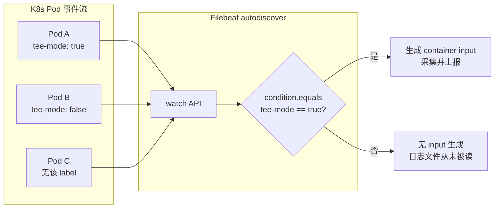

## 需求

只采集带特定 label 的 Pod 的日志，其他一律丢弃。例如：

```yaml
metadata:
  labels:
    log-export.platform/tee-mode: "true"    # 采
    # log-export.platform/tee-mode: "false" # 不采
    # 没这个 label                          # 不采
```

要求"从源头就不采"，不是"采完再丢"——后者浪费磁盘 IO 和网络带宽。

## 走 include/exclude_lines 行不通

`include_lines` / `exclude_lines` 是正则匹配 **日志内容整行**，跟 Pod label 完全无关，直接排除。

## 正确路径：kubernetes autodiscover + condition

Filebeat 的 `autodiscover` provider 会持续 watch K8s API 里的 Pod 事件，拿到每个 Pod 的完整元数据（含 labels/annotations）。`templates.condition` 决定 **只为满足条件的 Pod 动态生成采集任务**，其他 Pod 从头到尾没有 input 指向它，日志文件直接不读。



## 配置

```yaml
filebeat.autodiscover:
  providers:
    - type: kubernetes
      node: ${NODE_NAME}              # 只看本节点的 Pod，减小压力
      hints.enabled: true
      templates:
        - condition:
            equals:
              kubernetes.labels.log-export.platform/tee-mode: "true"
          config:
            - type: container
              paths:
                - /var/log/containers/*-${data.kubernetes.container.id}.log

# 用了 autodiscover 后，静态 filebeat.inputs 记得注释掉
```

Label key 里的 `.` 和 `/` 会被 Filebeat 自动做点分层级映射（`kubernetes.labels."log-export.platform/tee-mode"` 也可以写成 `kubernetes.labels.log-export.platform/tee-mode`），实测两种写法都识别，但带引号更稳。

## 别漏了 RBAC

Filebeat 要通过 API Server 读 Pod 元数据，ServiceAccount 得有 `pods` 的 `get/list/watch` 权限。少这一条，autodiscover 会静默地拿不到任何 Pod 事件，症状就是"配置没错但一个日志都没采"。

```yaml
apiVersion: rbac.authorization.k8s.io/v1
kind: ClusterRole
metadata:
  name: filebeat
rules:
  - apiGroups: [""]
    resources: ["namespaces", "pods", "nodes"]
    verbs: ["get", "list", "watch"]
```

## condition 的其他写法

`equals` 是完全匹配，其他常用的：

- `contains` — 子串匹配（label 值是逗号分隔列表时有用）
- `regexp` — 正则匹配
- `or` / `and` / `not` — 组合多个条件

例如"tee-mode=true **且** 命名空间不是 kube-system"：

```yaml
condition:
  and:
    - equals:
        kubernetes.labels.log-export.platform/tee-mode: "true"
    - not:
        equals:
          kubernetes.namespace: "kube-system"
```

## 顺带一提：为什么不用 processors.drop_event

`drop_event` 是"采完再丢"的路径——Filebeat 会先把日志读进来、组装成事件，然后丢弃。性能远不如 autodiscover condition 在 input 层就不生成。只有当过滤条件依赖 **日志内容本身** 而非 Pod 元数据时（例如 body 里的某个 JSON 字段），才用 `drop_event`。

---

> 本文基于与 DeepSeek 的一次对话整理，原始对话：<https://chat.deepseek.com/share/le7wetm4k0h8808le9>
