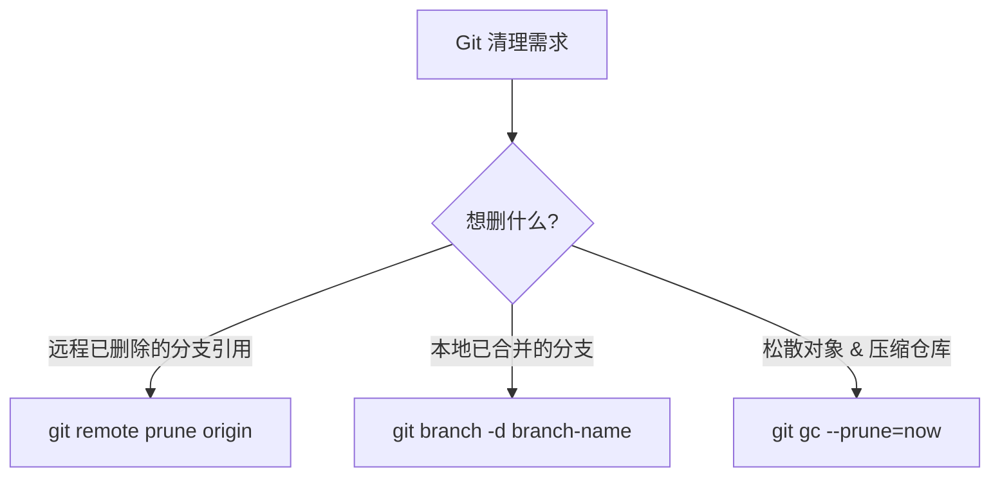

在工作目录里执行 `git prune` 想清理分支，结果毫无反应——这是很多 Git 用户踩过的坑。`git prune` 不会删分支，它操作的对象层级完全不同。

## 三个容易混淆的命令



| 命令 | 操作对象 | 影响范围 |
|------|----------|----------|
| `git prune` | 不可达的松散对象 | 对象数据库底层，不碰分支引用 |
| `git remote prune origin` | `remotes/origin/*` 引用 | 清理远程已不存在的跟踪分支 |
| `git gc --prune=now` | 松散对象 + 打包压缩 | 底层存储优化，不删分支 |

`git prune` 通常不需要直接调用——`git gc` 内部会自动调用它。

## 实操：一次完整的仓库清理

以下是在 `picasso-job-agent` 仓库的实际操作过程。

**初始状态**——远程有两个分支已合并删除，但本地还残留它们的引用：

```bash
$ git branch
  bump-picasso-go
  feat-error-code-line-a
  fix-duplicate-gomod
  fix-ja-namespace-dedup
* master
```

### 第一步：清理远程跟踪分支

```bash
$ git remote prune origin
Pruning origin
URL: ssh://git.example.com/ezone/picasso-job-agent.git
 * [pruned] origin/bump-picasso-go
 * [pruned] origin/feat-error-code-line-a
```

这一步删掉了 `remotes/origin/bump-picasso-go` 和 `remotes/origin/feat-error-code-line-a` 两个引用。注意：**本地分支仍然存在**——`git branch` 输出不变。

验证远程引用已清理：

```bash
$ git branch -a
  bump-picasso-go
  feat-error-code-line-a
  fix-duplicate-gomod
  fix-ja-namespace-dedup
* master
  remotes/origin/HEAD -> origin/master
  remotes/origin/master
```

### 第二步：压缩对象数据库

```bash
$ git gc --prune=now
Enumerating objects: 440, done.
Counting objects: 100% (440/440), done.
Delta compression using up to 16 threads
Compressing objects: 100% (302/302), done.
```

这步清理松散对象并重新打包，优化仓库存储。`--prune=now` 比默认更激进，会删除所有未被引用的对象（包括 reflog 中已过期的）。

### 第三步：删除本地分支

远程引用已经没了，对应的本地分支也就没有保留价值：

```bash
$ git branch | grep -v "master" | grep -v "\*" | xargs git branch -D
Deleted branch bump-picasso-go (was 7860aed).
Deleted branch feat-error-code-line-a (was e7a95d1).
Deleted branch fix-duplicate-gomod (was a7aed62).
Deleted branch fix-ja-namespace-dedup (was 346485a).
```

用 `-D` 而不是 `-d` 是因为这些分支的远程引用已经消失，Git 会认为它们"未合并"从而拒绝 `-d`。实际上它们早已合并进 master，`-D` 是安全的。

### 最终状态

```bash
$ git branch -a
* master
  remotes/origin/HEAD -> origin/master
  remotes/origin/master
```

## 日常工作流

合并一个功能分支后，建议跑这几步保持仓库整洁：

```bash
git checkout master
git pull
# 删除已合并的本地分支
git branch --merged | grep -v "\*" | grep -v "master" | xargs git branch -d
# 清理远程已不存在的跟踪引用
git remote prune origin
```

把这几步合成一个 alias 会更方便：

```bash
git config --global alias.cleanup '!git branch --merged | grep -v "\*" | grep -v "master" | xargs git branch -d && git remote prune origin'
```

之后 `git cleanup` 一条命令搞定。

## 为什么 `git remote prune` 不能自动删本地分支

很多人以为 `git remote prune` 删了远程引用后，对应的本地分支也会自动消失——不会。`git remote prune` 只操作 `refs/remotes/origin/*` 这个命名空间，本地分支在 `refs/heads/*` 下，互不干涉。这是 Git 的安全策略：远程分支可以随时消失，但本地的改动永远是受保护的。

---

> 本文基于与 DeepSeek 的一次对话整理，原始对话：https://chat.deepseek.com/share/4vt793akmoytw5n15g
