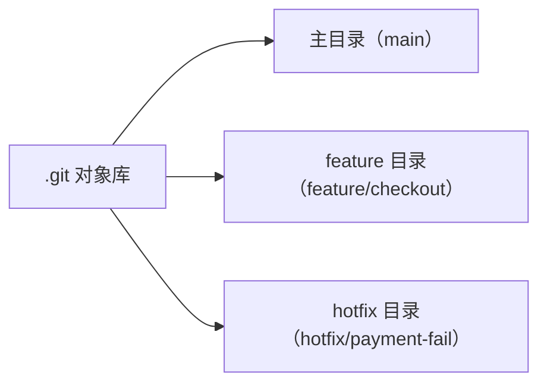

核心一句话：`git worktree` 让同一个仓库同时挂多个工作目录，每个目录独占一个分支，共享同一份 commit 历史和对象库。开发到一半要切去修线上 bug，不用 stash、不用来回 `git checkout`，直接开个新目录就行。

## 和普通 branch 的区别

传统做法是在一个工作目录里靠 `git checkout` + `git stash` 来回切上下文，切错了、忘了 stash 是常事，尤其是生产 bug 打断当前进度的时候。worktree 把"一任务 = 一分支 = 一目录"固化下来，物理隔离，脑子不用记当前在哪个分支。



每个目录都是独立的 checkout，编辑、提交、push 照常，但底层引用的是同一个 `.git` 对象库。这也是为什么不同目录里的分支能互相 merge——它们本来就在同一份历史里。

## 使用场景

最典型的是 feature 和 hotfix 并行。正在写一个功能，线上出了个 bug：

```bash
cd ~/projects/shop
# 开一个 feature 目录，同时新建分支
git worktree add -b feature/checkout ../shop-checkout
# 线上出 bug，再开一个 hotfix 目录
git worktree add -b hotfix/payment-fail ../shop-payment-hotfix
```

之后三个目录各干各的：`shop` 留 `main` 用于 merge 和 review，`shop-checkout` 继续开发，`shop-payment-hotfix` 修 bug。互不干扰。

## 常用命令

| 命令 | 作用 |
|------|------|
| `git worktree add ../path branch` | 把已有分支 checkout 到新目录 |
| `git worktree add -b new-branch ../path` | 新建分支并同时开 worktree |
| `git worktree list` | 列出所有 worktree 及对应分支 |
| `git worktree remove ../path` | 删除 worktree 目录 |
| `git worktree prune` | 清理已手动删除的 worktree 元数据 |

### list 看当前状态

```bash
$ git worktree list
/path/shop                  66c16256 [main]
/path/shop-checkout         0c8ba118 [feature/checkout]
/path/shop-payment-hotfix   a16e4be2 [hotfix/payment-fail]
```

哪些分支被 checkout 到哪个目录一目了然，也避免了"想用某个分支却发现它已经挂在别的 worktree 上"的情况。

### remove 和 prune

功能做完、分支合并后，`git worktree remove ../path` 删目录。注意它只删目录、不删分支，而且要求工作区干净，否则得加 `--force`。主 worktree 不能被 remove。

如果手动 `rm -rf` 删了目录，Git 还会留着元数据，`git worktree list` 会显示 `prunable` 标记，用 `git worktree prune` 清掉。`--expire` 按时间过滤：

```bash
git worktree prune --expire 7.days.ago
```

## 合并回主分支

worktree 的合并和普通分支没区别，只是上下文更清晰——每个分支物理隔离在独立目录里，不容易提交错分支：

```bash
# 在 feature 目录里提交完
cd ~/projects/shop && git checkout main
git merge feature/checkout
```

## 一个限制

同一个分支不能同时被多个 worktree checkout。这其实是约束也是好处：逼着你保持"一任务一分支一目录"的映射，脑子不会乱。

Git 2.5 就有这个功能了（快十年），纯顺序开发还是普通分支更省事，但一旦需要"同时出现在两个地方"，worktree 是唯一优雅的解。

---

> 本文整理自 barrd.dev 的文章 [Parallel development without the headaches using Git worktree](https://barrd.dev/article/parallel-development-without-the-headaches-using-git-worktree/)。
