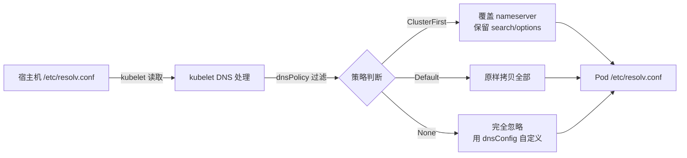
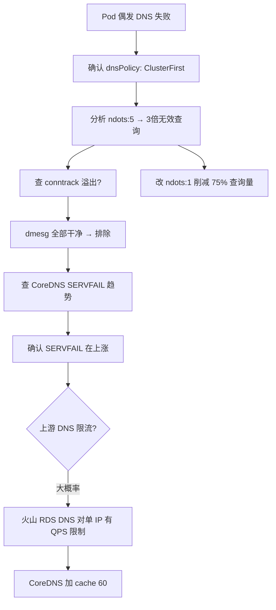

一次真实的线上排查：集群内 Pod 偶发访问同可用区 RDS PostgreSQL 失败，报 DNS 解析错误。最终定位到 `ndots:5` 放大无效查询 → CoreDNS 上游限流 → SERVFAIL 的链条。

## Pod 的 DNS 配置从哪来

很多人的第一反应是"Pod 直接读宿主机的 `/etc/resolv.conf`"，实际上不是。kubelet 以宿主机该文件为**模板**，经过过滤和改写后再注入 Pod。

整个链路：



kubelet 只提取 `nameserver`、`search`、`options` 三个字段，然后按 `dnsPolicy` 决定怎么用。

## 三种 dnsPolicy 的实际效果

### ClusterFirst（默认，绝大多数 Pod）

宿主机 `nameserver` 被**完全忽略**，kubelet 强制写入集群 CoreDNS 的 Service IP。但 `search` 和 `options`（如 `ndots:5`）会保留，并**追加**集群 namespace 后缀。

实际效果：

```
# 宿主机
nameserver 172.x.x.110
nameserver 100.x.x.2

# Pod（dnsPolicy: ClusterFirst）
nameserver 10.x.x.10          ← 被覆盖为集群 CoreDNS IP
search <ns>.svc.cluster.local svc.cluster.local cluster.local
options ndots:5
```

### Default

宿主机配置原样拷贝。Pod 完全使用宿主机 DNS，但**无法通过 Service 短名称访问其他 Pod**。

### None

宿主机配置完全忽略，由 `spec.dnsConfig` 自定义。

## ndots:5 —— 最隐蔽的性能杀手

`ndots` 的值决定了 DNS 解析器**何时**去拼接 `search` 域：

- 域名点数 **< ndots** → 先依次拼接所有 search 域，最后查原始域名
- 域名点数 **≥ ndots** → 直接查原始域名

默认 `ndots:5` 意味着：只要域名点数不到 5，就先走一轮 search 拼接。对于 K8s 内部 Service 短名称（如 `my-service`，0 个点），这很方便。但对外部域名，这是灾难。

以火山引擎 RDS 地址为例：

```
pg-xxx.rds-pg.example.com
        1             2       3      4   ← 4 个点，小于 5
```

每次访问这个 DB，DNS 解析器实际查询 4 次：

```
1. xxx.rds-pg.ivolces.com.<ns>.svc.cluster.local → NXDOMAIN
2. xxx.rds-pg.ivolces.com.svc.cluster.local      → NXDOMAIN
3. xxx.rds-pg.ivolces.com.cluster.local           → NXDOMAIN
4. xxx.rds-pg.ivolces.com                         → 成功
```

**每次成功解析之前有 3 次必然失败的查询**。如果 CoreDNS 负载高、网络抖动、conntrack 冲突导致其中某次超时（5 秒内核超时），应用就报 DNS 解析失败。

改成 `ndots:1`：

```
1. xxx.rds-pg.ivolces.com → 成功
```

一次查询，失败空间从 4 降到 1。而且 Service 短名称访问（0 个点，0 < 1）依然会拼接 search 域，不影响 K8s 内部通信。

修改方式：

```yaml
spec:
  dnsPolicy: ClusterFirst
  dnsConfig:
    options:
      - name: ndots
        value: "1"
```

## 线上案例：追踪 SERVFAIL

真实环境：火山引擎集群，`dnsPolicy: ClusterFirst`，DB 地址如上。Prometheus 监控到 CoreDNS 的 `SERVFAIL` 在 24 小时内从 2 涨到 28。

排查过程：



第一步：确认受影响 Pod 的配置。

```bash
kubectl get pod <pod> -o yaml | grep dnsPolicy
# dnsPolicy: ClusterFirst

kubectl exec <pod> -- cat /etc/resolv.conf
# nameserver 10.x.x.10
# search <ns>.svc.cluster.local svc.cluster.local cluster.local
# options ndots:5
```

第二步：排除 conntrack。在所有 Node 上跑了 `dmesg -T | grep "nf_conntrack: table full"`，全部干净 —— 内核层面没有丢包。

第三步：确认上游 DNS 问题。CoreDNS 日志里有大量上游返回的 SERVFAIL，说明火山引擎内网 DNS 在压力下开始拒绝请求。而这压力的一部分来源就是 `ndots:5` 产生的 3 倍无效查询。

## 修复方案

1. **业务 Pod 加 `dnsConfig: ndots:1`**：DNS 查询量直接削减 75%，CoreDNS 和上游 DNS 压力同步降低
2. **CoreDNS 加 `cache 60`**：即使上游偶尔 SERVFAIL，缓存命中直接返回 IP
3. **如果问题持续**：联系火山引擎确认 RDS DNS 的 QPS 限流策略，提高阈值或改用 RDS 固定 VIP

修完后观察 24 小时，`SERVFAIL` 从 28 回落。

## 排查清单

遇到 Pod DNS 问题时，按这个顺序来：

| 步骤 | 命令 | 看什么 |
|---|---|---|
| 1 | `kubectl exec <pod> -- cat /etc/resolv.conf` | nameserver 是不是集群 IP，ndots 是多少 |
| 2 | `kubectl get pod <pod> -o yaml \| grep dnsPolicy` | 确认策略 |
| 3 | 统计域名点数 | 点数 < ndots 就会触发 search 拼接 |
| 4 | `dmesg \| grep conntrack` | 排除内核丢包 |
| 5 | CoreDNS Prometheus 指标 | 看 SERVFAIL / 超时趋势 |
| 6 | `kubectl logs -n kube-system -l k8s-app=kube-dns` | 看上游 DNS 返回了什么 |

---

> 本文基于与 DeepSeek 的一次对话整理，原始对话：https://chat.deepseek.com/share/wv7takou7bv463ufah
