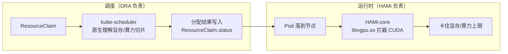

DRA 不会取代 HAMi。两者是互补关系：DRA 接管「调度决策」，HAMi 保留「运行时执行」。分界线一句话说清——GPU 切片该分多少、分给谁，是 DRA 的活；分完之后容器里能不能真的卡住这个上限，是 HAMi 的活。

## 各管什么

**DRA（Dynamic Resource Allocation）** 是 Kubernetes 原生 API，解决「如何表达和调度 GPU 切片」。旧模式下 HAMi 靠 annotation + 扩展调度器曲线救国；DRA 引入 `ResourceClaim` 标准对象，让 kube-scheduler 原生理解「这块卡要多少显存、多少算力」。

**HAMi-core** 是 HAMi 不可替代的部分。它是一个通过 `libvgpu.so` 预加载的 CUDA 拦截库，在容器运行时真正卡住资源上限——不让容器抢占它没申请到的显存或算力。这件事在 DRA 的设计范围之外。

## HAMi 怎么适配 DRA

HAMi 没有躺平等死，而是主动把调度能力让渡给 DRA：

- **`k8s-dra-driver`**：首个为 NVIDIA GPU 提供 DRA 支持的开源驱动，把 GPU 的显存和算力发布成 DRA 能读懂的 `ResourceSlice`。
- **HAMi-DRA**：一个变更准入 Webhook。用户照旧写 `nvidia.com/gpumem: 8000` 这种旧格式，Webhook 自动转成标准 `ResourceClaim`，存量 YAML 一行不用改。
- **生产就绪**：截至 2026 年 7 月，HAMi-DRA v0.2.1 已宣布 production-ready，支持 NVIDIA、昇腾（Ascend）、燧原（Enflame）。

## 两种模式对比

| 维度 | Device Plugin 模式 | DRA 模式 |
| :--- | :--- | :--- |
| 资源请求 | opaque 整数的扩展资源 | 类型化 `ResourceClaim` |
| 调度决策 | HAMi 调度器扩展 | kube-scheduler |
| 分配结果 | 只有 HAMi 能读的 annotation 字符串 | `ResourceClaim.status`，kubectl/RBAC 可查 |
| 运行时限流 | HAMi-core | HAMi-core（不变） |
| 芯片支持 | 12+ 设备家族 | NVIDIA 成熟，昇腾/燧原跟进中 |
| K8s 版本 | 任意受支持版本 | v1.34+（开特性门），v1.36 默认开启 |

## 怎么选

**继续传统模式**：K8s 版本在 v1.34 之前，或托管集群改不了 API Server 特性门；集群里有多种非 NVIDIA 加速器（DRA 驱动对这些芯片支持还不完善）。

**可以试 DRA**：纯 NVIDIA 集群 + K8s v1.36+（特性默认开启）。测试环境先上 HAMi-DRA Webhook，因为不用改现有 YAML。

## 注意事项

- **两种模式不能同集群并存**。传统 Device Plugin 和 DRA 同时跑，两个调度器会互相争夺 GPU，直接乱套。
- **`DRAConsumableCapacity`**（允许分片共享的特性）在 v1.36 仍是 Beta，未 Stable。
- **HAMi-DRA 不做拓扑感知调度**（如 NVLink 亲和性），多卡通信密集的场景可能掉性能。

---

> 本文基于与 DeepSeek 的一次对话整理，原始对话：<https://chat.deepseek.com/share/2pzf7an3e1a5seuxhd>
