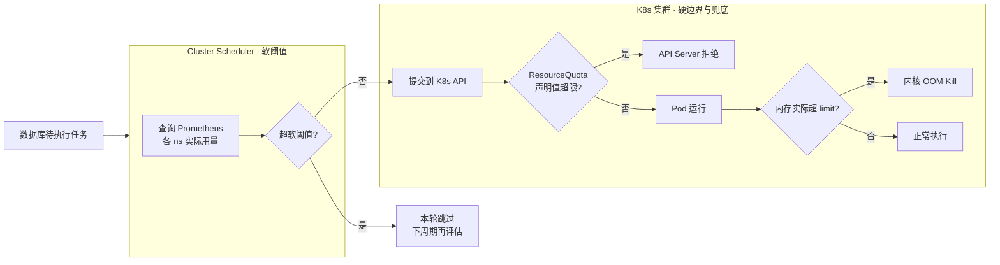

## 背景

系统里有一个 Cluster Scheduler，从数据库拉待执行的任务，按 10~30s 的周期下发到 K8s 集群里跑。任务量涨上来之后需要一层准入控制，让 scheduler 感知集群实际负载，别把集群打爆。

K8s 原生的 ResourceQuota 拦截的是 Pod 声明值（`requests`/`limits`），感知不到实际用量。任务申请 1C2G 但实际吃 2C4G，配额毫无察觉，直到节点 OOM 才知道出事。所以硬边界不够用，还得有一层基于真实用量的软控制。

## 三层准入

外部 scheduler + Prometheus 做软阈值，ResourceQuota + LimitRange 做硬边界，内核负责最后兜底：



Scheduler 的主循环也就几十行：

```python
while True:
    usage = prometheus.query(
        "sum(namespace:container_cpu_usage_seconds_total:rate5m) by (namespace)"
    )

    blocked = set()
    for ns, cfg in namespace_configs.items():
        actual = usage.get(ns, 0)
        # 滞后区：超 110% 才拦，降到 90% 才放
        if actual >= cfg.soft_limit * 1.1:
            state[ns].blocked = True
        elif actual <= cfg.soft_limit * 0.9:
            state[ns].blocked = False
        if state[ns].blocked:
            blocked.add(ns)

    for task in db.query("SELECT * FROM tasks WHERE status='pending'"):
        if task.namespace in blocked:
            continue
        create_k8s_resource(task)
        db.update(task.id, status='dispatched')

    sleep(interval)
```

## 几个绕不开的坑

**滞后区**。软阈值上下各留 10% 的缓冲带（90% 恢复、110% 拦截）。少了这一步，用量在边界附近抖动时 scheduler 会疯狂"限流—恢复—限流"，用户体验和事件流都会炸。这是最容易被忽略但又最必要的一环。

**CPU 和内存要分开对待**。CPU 可压缩，超一点只是变慢；内存不可压缩，一旦超 `limit` 就 OOM Kill，控制器根本来不及反应。所以 CPU 的软阈值可以放宽到 150%，内存最好收在 105% 以内，独立告警。

**LimitRange 必须部署**。ResourceQuota 只对声明了 `requests`/`limits` 的 Pod 生效。如果用户不写，声明总和永远是 0，硬边界形同虚设。每个多租户 namespace 都要配 LimitRange 注入默认值，不然整套逻辑都是空中楼阁。

**Completed Pod 要清**。Job 跑完后如果没设 `ttlSecondsAfterFinished`，Pod 会残留在 API Server 里。它们不吃资源，但仍计入 ResourceQuota，会出现"Prometheus 说资源空、ResourceQuota 却拒绝创建"的诡异冲突。统一给 Job 设 `ttlSecondsAfterFinished: 600` 就好。

**冷启动限速**。Scheduler 刚起或有新 namespace 加入时，Prometheus 还没稳定的采集数据，容易一批任务全冲进去。前几个周期做个下发数量上限（比如每轮最多 5 个），等指标追上再放开。

**Prometheus 挂了怎么办**。监控不能是调度的硬依赖。查询连续失败超过阈值时长，scheduler 应该保守**放行**而不是保守**拦截**——反正 ResourceQuota 还在，最坏情况下硬边界能兜住；反过来拦截会让任务积压成灾。

**Pending/Running 比值熔断**。用量维度之外的另一个独立信号。集群里 Pending Pod 数量相对 Running 明显偏高，说明调度器已经排不动了，此时应停止下发等消化，而不是继续往里塞。

## 什么时候换 Kueue

[Kueue](https://kueue.sigs.k8s.io/) 是 CNCF 的 K8s 原生作业队列，能力上覆盖上述方案且更完整。当前场景没上它的原因很直接：任务源在数据库不在 K8s，Kueue 的 `ClusterQueue`/`LocalQueue` 模型假设作业已经是 K8s 对象，接入需要额外的提交代理；而且只有普通批处理，用不上它的高级特性。

哪些信号出现时值得切：

| 场景 | 自研成本 | Kueue |
| :--- | :--- | :--- |
| 多集群作业分发 | 要维护多个 K8s client 池和路由策略 | MultiKueue 原生 |
| 多租户借用/抢占空闲配额 | 要自研历史用量加权算法 | Fair Sharing + Cohorts 内置 |
| 分布式训练（PyTorchJob/RayJob） | Pod 级限流做不到"全有或全无" | All-or-Nothing 准入 |
| GPU 拓扑感知 | 要接管调度逻辑 | Topology-Aware Scheduling |

切过去之后 scheduler 不用删，退化成一个纯提交代理即可——从数据库读任务、生成 K8s Job、打上 `kueue.x-k8s.io/queue-name` 标签，剩下的排队、准入、公平分配全交给 Kueue。

Gang Scheduling 场景要更谨慎。Kueue 只保证"所有 Pod 同时被准入"，不保证"同时被调度到节点"。分布式训练如果部分 worker 起不来就等于全废，此时更合适的是 Volcano——它直接接管 kube-scheduler，用 `PodGroup` 保证一整个作业的 Pod 一次性落到节点。业界也有 Kueue 管配额、Volcano 管调度的组合玩法。

选型不是比谁功能强，而是看当前架构和真实痛点。已经有外部 scheduler + 只跑批处理的场景，Prometheus + ResourceQuota + LimitRange 三层能兜底大部分问题，成本远低于引入 Kueue 或 Volcano。等到 Gang Scheduling、多集群、公平共享真正成为刚需再切也不晚。

---

> 本文基于与 DeepSeek 的一次对话整理，原始对话：<https://chat.deepseek.com/share/ej41zd012dxyr96z7a>
