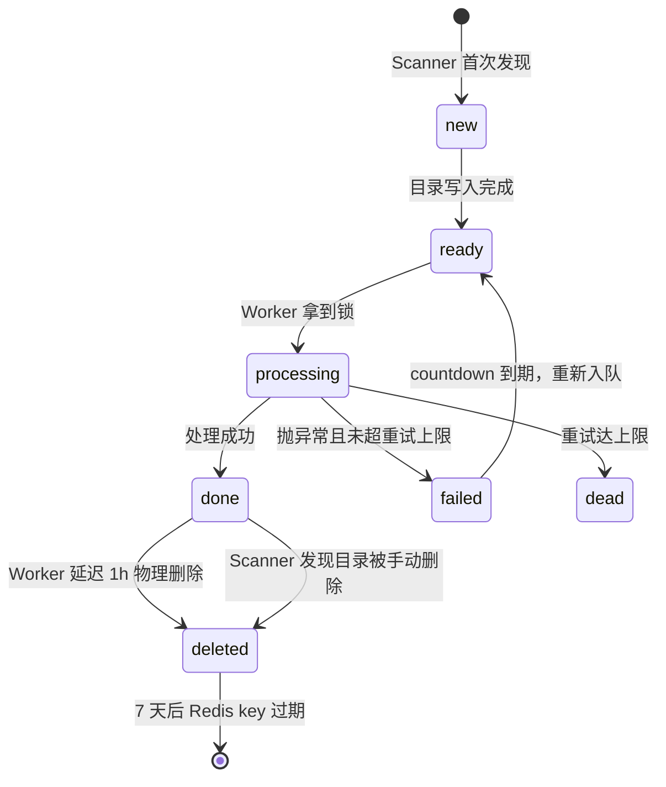
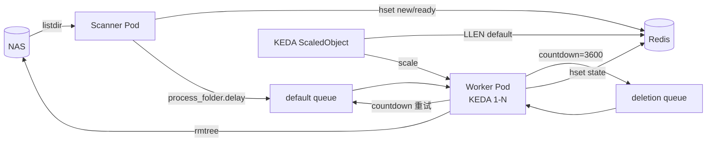

## 场景

NAS 上有一批 `/nas/{action_id}/` 一级目录，外部持续写入。需要一个后台管线做三件事：发现新目录、处理内容、处理完成一小时后物理删除。约束：

- 同一目录同一时刻只能有一个 worker 处理
- 失败要指数退避重试，达上限进死信并告警
- 处理阶段部署在 K8s，用 KEDA 按队列长度弹性伸缩

先把状态定下来，其它设计都围绕这五个状态转。

## 状态机



`failed` 是过程状态而不是终态——它只是"下一轮 ready 之前的 parking 位"，用来让状态可观测（能看到某个 action 正在退避中）。真正终态是 `deleted` 和 `dead`。

## 组件拆分

只有两个进程角色，`Scanner` 和 `Worker`，之间的胶水是 Celery 队列。

| 组件 | 状态归属 | 副本 |
|------|---------|------|
| Scanner | `new` / `ready`，以及手动删除触发的 `deleted` | 单副本，Deployment，每分钟一轮 |
| Worker  | `processing` / `done` / `failed` / `dead`，以及延迟触发的 `deleted` | KEDA 1-N |

Worker 同时订阅 `default` 和 `deletion` 两个队列：

```bash
celery -A celery_app worker -Q default,deletion --concurrency=4
```

`default` 承载正常处理和失败重试，`deletion` 承载 1h 后的物理删除。删除任务本身极轻，KEDA 只监控 `default` 就够了。

## Scanner：差量扫描

不用每次进 Redis 逐个 key 对状态，而是维护上一轮的目录集合，本轮差量出 `new` 和 `deleted`：

```python
current = set(os.listdir('/nas/'))
last = snapshot_from_redis()
new_ids = current - last
gone_ids = last - current
```

`new_ids` 里的目录如果满足 ready 判据（`.ready` 标记文件或 mtime 稳定 5 分钟），就 `hset state=ready` 并 `process_folder.delay(action_id)` 入队。`gone_ids` 里的目录说明被手动清掉了，直接把 Redis 状态改成 `deleted`，同时清一下残留在队列里的 action_id。

### 快照必须持久化

这一步是坑。如果快照只在内存里，Scanner 重启后 `last = ∅`，第一轮扫描会把 NAS 上**已有的所有目录**当作新增，全部重新入队——正在处理的 action 会被重复提交，历史遗留目录会被"复活"。

修复很便宜，就是把集合 dump 成 JSON 存到 Redis 一个 key 里：

```python
SNAPSHOT_KEY = 'scanner:last_snapshot'

def get_last_snapshot():
    raw = r.get(SNAPSHOT_KEY)
    if raw:
        return set(json.loads(raw))
    # 冷启动：把当前状态作为快照存下，不触发任何 new / deleted 事件
    current = scan_nas()
    r.set(SNAPSHOT_KEY, json.dumps(list(current)))
    return current
```

冷启动那次返回 `current` 而不是 `∅`——冷启动瞬间 NAS 上任何目录都不算"新增"，等下一轮才有意义。

## Worker：一个任务干完所有事

早期设计里跑偏过：搞了 `retry_queue` + `retry_folder` 中转任务专门做重试入队，还给"物理删除"单独拆了个 `Cleaner` 进程。全都是过度设计，收敛回来只需要两个 Celery task。

### countdown 才是关键

Celery 里 `apply_async(countdown=10)` 的语义常被误解。它不是"worker 拿到任务后 sleep 10 秒再执行"，而是**broker 侧延迟 10 秒才让 worker 看到这个任务**——用 Redis 做 broker 时，任务先进 `unacked` ZSET，到期才 `RPUSH` 到实际的 List。

这意味着延迟重试和延迟删除都不需要额外队列，一行代码搞定：

```python
process_folder.apply_async(args=[action_id], countdown=delay)   # 延迟重试
delete_folder.apply_async(args=[action_id], countdown=3600)     # 延迟删除
```

弄清楚这一点，`retry_queue` 就可以砍掉。

### 处理任务全貌

```python
@app.task(bind=True, name='tasks.process_folder')
def process_folder(self, action_id: str):
    status_key = f'folder:status:{action_id}'
    lock_key = f'folder:lock:{action_id}'

    state = r.hget(status_key, 'state')
    if state in ('processing', 'done', 'deleted'):
        return  # 幂等

    if not r.set(lock_key, self.request.id, nx=True, ex=300):
        process_folder.apply_async(args=[action_id], countdown=60)
        return

    try:
        r.hset(status_key, 'state', 'processing')
        do_business_logic(f'/nas/{action_id}')
        r.hset(status_key, mapping={'state': 'done', 'done_time': time.time()})
        delete_folder.apply_async(args=[action_id], countdown=3600, queue='deletion')

    except Exception as e:
        retry_count = r.hincrby(status_key, 'retry_count', 1)
        r.hset(status_key, 'last_error', str(e))

        if retry_count >= MAX_RETRY:
            r.hset(status_key, 'state', 'dead')
            r.lpush('queue:dead_letter', f'{action_id}:{e}')
        else:
            delay = min(2 ** retry_count, 60)
            r.hset(status_key, 'state', 'failed')
            process_folder.apply_async(args=[action_id], countdown=delay)
    finally:
        r.delete(lock_key)
```

### 为什么不用 self.retry()

`self.retry(countdown=delay)` 也能做到延迟重试，但它把重试计数藏在 Celery task metadata 里，运维时得去 Flower 或 result backend 才能查。而手动 `apply_async` + 自己在 Redis 里 `HINCRBY retry_count`，所有状态都在同一个 hash 里，`HGETALL folder:status:xxx` 一把 dump 出来，运维体验好得多。

代价是要自己判断 `MAX_RETRY`，接受这个换。

### 分布式锁的边界

锁 TTL 300s。约定业务处理超过 300s 就当失败，不做锁续期——续期需要后台线程 + 处理主线程之间做心跳，复杂度立刻上一个台阶。业务侧自己保证在 300s 内跑完（拆子任务、加超时）比在框架里搞续期干净。

## 删除失败告警

物理删除失败分两类，反应不一样：

- `PermissionError`：立即 critical 告警，不重试。权限问题重试没意义，需要人排查
- 其它异常（NAS 短暂抖动、文件被占用等）：warning 告警，`countdown=3600` 后重试，累计 3 次仍失败进死信

```python
@app.task(name='tasks.delete_folder')
def delete_folder(action_id: str):
    status_key = f'folder:status:{action_id}'
    if r.hget(status_key, 'state') != 'done':
        return

    folder_path = f'/nas/{action_id}'
    try:
        shutil.rmtree(folder_path)
        r.hset(status_key, mapping={'state': 'deleted', 'deleted_at': time.time()})
        r.expire(status_key, 604800)
        r.delete(f'delete:failed:{action_id}')

    except PermissionError as e:
        alert('critical', action_id, e)
        r.hset(status_key, 'state', 'delete_permission_failed')

    except Exception as e:
        fail = r.hincrby(f'delete:failed:{action_id}', 'count', 1)
        r.expire(f'delete:failed:{action_id}', 86400)
        if fail >= 3:
            alert('critical', action_id, e)
            r.hset(status_key, 'state', 'delete_failed')
            r.lpush('queue:dead_letter', f'delete_failed:{action_id}:{e}')
        else:
            if fail == 1:
                alert('warning', action_id, e)
            delete_folder.apply_async(args=[action_id], countdown=3600, queue='deletion')
```

`alert()` 后端不敏感——Webhook 打钉钉、Pushgateway 打 Prometheus、结构化日志推 Loki 都行，接现有告警链路。

## KEDA 扩缩容

`default` 队列长度作为唯一指标：

```yaml
apiVersion: keda.sh/v1alpha1
kind: ScaledObject
metadata:
  name: celery-worker-scaler
spec:
  scaleTargetRef:
    name: celery-worker
  minReplicaCount: 1
  maxReplicaCount: 10
  pollingInterval: 10
  cooldownPeriod: 60
  triggers:
  - type: redis
    metadata:
      address: redis-service:6379
      listName: default
      listLength: "5"
```

`listLength: "5"` 的含义是 `ceil(队列长度 / 当前 Pod 数) > 5` 触发扩容——12 个任务、2 个 Pod（平均 6）扩到 3；12 个任务、3 个 Pod（平均 4）不动。

### Celery 侧要配合

KEDA 数队列长度，Celery 默认 `worker_prefetch_multiplier=4` 会把任务从队列拉进 worker 内存，队列长度虚低，弹性伸缩就不准。所以：

```python
app.conf.update(
    worker_prefetch_multiplier=1,      # 每个 worker 一次只拉一个
    task_acks_late=True,               # 处理完才 ACK，中途 kill 不丢
    task_reject_on_worker_lost=True,   # Worker OOM 时任务自动重入队列
)
```

### 优雅关闭

缩容时 K8s 会给 Pod 发 SIGTERM，`preStop` 里调 `celery control shutdown` 让 worker 处理完当前任务再退，配 `terminationGracePeriodSeconds: 600` 给足时间：

```yaml
lifecycle:
  preStop:
    exec:
      command: ["celery", "-A", "celery_app", "control", "shutdown"]
terminationGracePeriodSeconds: 600
```

## Redis Key 一览

| Key | 类型 | 用途 | TTL |
|-----|------|------|-----|
| `scanner:last_snapshot` | String(JSON) | Scanner 上一轮的目录集合 | 永久 |
| `folder:status:{action_id}` | Hash | 状态 + retry_count + 时间戳 + 最后错误 | done→deleted 后 7 天 |
| `folder:lock:{action_id}` | String | 分布式锁 | 300s |
| `delete:failed:{action_id}` | Hash | 删除失败计数 | 86400s |
| `default` / `deletion` | List | Celery broker 队列 | - |
| `queue:dead_letter` | List | 死信 | 永久 |

## 整体拓扑



Scanner 是单副本可以接受——挂掉最多延迟 1 分钟发现新目录，业务侧完全无感。Redis 才是唯一硬依赖，生产用 Sentinel 或 Cluster 兜底。

---

> 本文基于与 DeepSeek 的一次对话整理，原始对话：https://chat.deepseek.com/share/jgv2c4f431g49hjyp4
