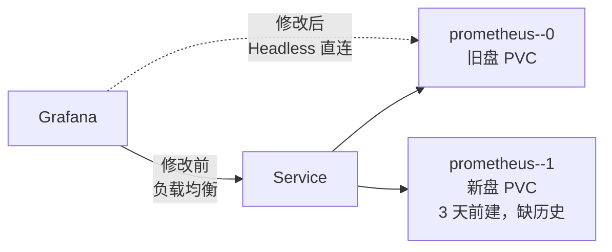

kube-prometheus-stack 部署的 Prometheus，`replicas: 2` 双副本，每个 Pod 各挂一块 PVC，汰换周期 14d。某天把单副本改成双副本，新盘三天前才建。之后 Grafana 查询开始随机命中两块盘，出现「一会儿有数据一会儿没数据」，刷新几次结果在两者间跳动。

根因：Grafana 数据源指向普通 Service，负载均衡随机把请求分到两个 Pod；两个 Pod 挂的 PVC 数据时间线不一致——新盘只建了三天，缺 3 天前的历史数据。



## 关键认知：14 天不一定自动对齐

直觉上「熬过汰换周期数据就对齐了」，但这只在两块盘**同时启动、同时写数据**的前提下成立。这里新盘是三天前才建的，等于从单副本切到双副本，历史数据存在永久性空洞：

- 新盘若从旧盘拷贝而来，拷贝时漏掉的历史 block **永远不会自动补上**——Prometheus 只写实时数据，不补写历史。
- 哪怕过了 14 天，只要查询范围还覆盖「新盘缺失的那段历史」，跳动依然存在。

先确认到底缺没缺，别盲目等 14 天：

```bash
# 对比两块盘上的 block 列表（进 Pod 看挂载目录）
ls -la /prometheus/ | grep -E '^d.*[0-9]{10}'
```

## 方案怎么选

| 方案 | 说明 | 取舍 |
| :--- | :--- | :--- |
| Thanos 查询层去重 | 部署 Thanos Query，按 `replica` 外部标签合并去重 | 彻底，但为一个数据对齐问题上整套组件，重 |
| 直连旧盘 Pod | 把 Grafana 数据源从 Service 改成旧盘 Pod 的 Headless 地址 | 零成本，临时绕过负载均衡，数据对齐后再切回 |
| PromQL 聚合补漏 | `max(...) by (...)` 或 `or` 拼接两个实例 | 应急，面板多了改起来麻烦 |

最终用第二种。思路：旧盘数据最全，把 Grafana 固定到旧盘，不再随机。

## kube-prometheus-stack 环境下的操作

这个环境的数据源不是手动配的，而是 Grafana sidecar 通过 ConfigMap 自动发现。直接改 ConfigMap 里的 `url` 即可。

### 1. 找到数据源 ConfigMap

```bash
kubectl get cm -n <namespace> | grep grafana-datasource
```

通常是 `*-grafana-datasource`，里面 `datasources:` 列表的 `url` 指向普通 Service（负载均衡地址）。

### 2. 找到旧盘 Pod 的直连地址

Headless Service 由 Prometheus Operator 自动创建，Pod 直连地址格式：

```
http://<pod-name>.<headless-service-name>.<namespace>.svc.cluster.local:9090/
```

两个最容易搞错的地方：

- **Pod 名带 release 前缀**，不是 `prometheus-0`，而是 `prometheus-<release-name>-0`：
  ```bash
  kubectl get pods -n <namespace> | grep prometheus
  # prometheus-pr-supporter-0   ← 实际是这个
  # prometheus-pr-supporter-1
  ```
- **Headless Service 名**，Operator 默认创建的是 `prometheus-operated`（`ClusterIP: None`）：
  ```bash
  kubectl get svc -n <namespace> | grep prometheus-operated
  # prometheus-operated  ClusterIP  None  9090/TCP
  ```

改之前先验证地址能解析（从 Grafana Pod 内）：

```bash
kubectl exec -it -n <namespace> deployment/grafana -- sh -c \
  "nslookup prometheus-<release>-0.prometheus-operated.<namespace>.svc.cluster.local"
```

能返回 Pod IP 再改，别改完才发现 `no such host`。

### 3. 确认哪块是旧盘

Pod 年龄会骗人——Pod 重启后 AGE 重新计，不代表盘年龄。查 PVC 创建时间才准：

```bash
kubectl get pvc -n <namespace> | grep prometheus
```

创建时间更早的那块就是旧盘，直连它对应的 Pod。

### 4. 改 ConfigMap

```bash
kubectl edit cm <datasource-cm> -n <namespace>
```

把 `url` 从 Service 地址改成旧盘 Pod 直连地址，旧值加 `#` 注释保留以便切回。sidecar 约 30s 内自动 reload，日志会打：

```
Datasources config reloaded ... Response: 200 OK
```

Grafana 里 Save & Test 通过即生效。

### 5. 数据对齐后切回

等新盘满汰换周期、两块盘数据对齐，把 `url` 改回原 Service 地址，恢复负载均衡。

## 备忘

- sidecar 数据源由 ConfigMap 管理，改完自动 reload（~30s），不用重启 Grafana。
- `no such host` 基本都是 Pod 名或 Service 名拼错，不是网络问题——先 `kubectl get pods/svc` 核对真实名字。
- 用 PVC 创建时间而非 Pod AGE 判断哪块是旧盘。

---

> 本文基于与 DeepSeek 的一次对话整理，原始对话：<https://chat.deepseek.com/share/4l0i190ue119bodqch>
