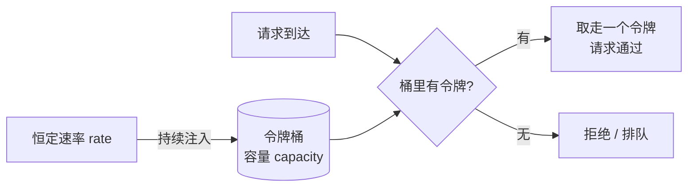

令牌桶（Token Bucket）是一种流量整形 / 限流算法：用「桶」存固定数量的令牌，以恒定速率往桶里加令牌，请求来了取令牌，取不到就拒绝。既能平滑长期速率，又允许短期突发。



## 核心概念

- **桶**：固定容量容器，存令牌。
- **令牌**：一个令牌代表放行一个请求。
- **注入速率 rate**：每秒往桶里加的令牌数，直到桶满。
- **处理流程**：请求到达 → 有令牌则取走一个放行，否则拒绝或排队。

## 关键参数

| 参数 | 含义 |
| :--- | :--- |
| `capacity` | 桶最大容量，决定**允许的最大突发量** |
| `rate` | 注入速率，决定**长期平均处理速率** |

## 三个特点

1. **允许突发**：系统空闲时令牌积累满桶，短时间内可处理高于平均速率的请求（上限 = capacity）。
2. **平滑流量**：长期看平均速率不会超过 rate。
3. **易实现**：只需记录上次补充时间和当前令牌数，请求到达时按时间差补令牌。

## 实现

```python
class TokenBucket:
    def __init__(self, rate, capacity):
        self.rate = rate          # 每秒注入令牌数
        self.capacity = capacity  # 桶容量
        self.tokens = capacity    # 初始满桶
        self.last = time.monotonic()

    def allow(self) -> bool:
        now = time.monotonic()
        # 按时间差补充令牌，封顶
        self.tokens = min(self.capacity, self.tokens + (now - self.last) * self.rate)
        self.last = now

        if self.tokens >= 1:
            self.tokens -= 1
            return True
        return False
```

时间差用单调时钟（`time.monotonic()`），别用墙钟，否则系统时间回拨会导致令牌异常累积。

## 与其他限流算法对比

| 算法 | 特点 | 适用场景 |
| :--- | :--- | :--- |
| 令牌桶 | 允许突发，平均速率可控 | 应对突发流量、保护后端 |
| 漏桶 | 恒定速率输出，强制平滑 | 严格限速（网络 QoS） |
| 固定窗口计数器 | 实现简单，窗口边界有突刺 | 简单 QPS 限制 |

令牌桶和漏桶的核心区别：令牌桶按「到达速率」控制，允许突发；漏桶按「离开速率」控制，彻底削平。令牌桶是漏桶的「允许突发」版本。

## 应用场景

- API 限流：控制调用频率，允许短时突发但长期平均可控。
- 网络流量整形：路由器控制发包速率。
- 下游保护：防止瞬时流量冲垮后端服务。

分布式场景单机令牌桶不够用，需要共享计数（如 Redis + Lua 原子操作），以及考虑令牌发放的全局一致性。

---

> 本文基于与 DeepSeek 的一次对话整理，原始对话：<https://chat.deepseek.com/share/w7rfxt1qreofqds7yp>
