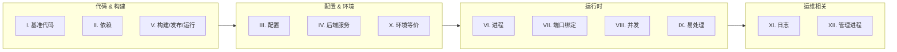

Heroku 在 2011 年提出的 Twelve-Factor App 方法论，到今天仍然是理解云原生应用设计的入口。十二条原则解决的核心问题是：如何让应用在任何云环境中一致地构建、部署和运行。

## I. 基准代码

一份代码，多份部署。不是为 dev/staging/prod 各维护一个分支，而是同一个 commit 配合不同配置部署到不同环境。

落地到 K8s 就是同一个镜像 tag，通过 ConfigMap/Secret 切换环境。

## II. 依赖

显式声明，隔离管理。`package.json`、`go.mod`、`requirements.txt` 是事实标准。CI 里应该用 lockfile 锁定版本，容器构建时用 multi-stage 把依赖层缓存好。

## III. 配置

环境变量注入，不写进代码。K8s 里用 Secret + ConfigMap，本地开发用 `.env`（但 `.env` 不进仓库）。数据库连接串、API Key、feature flag 全部走环境变量。

## IV. 后端服务

数据库、缓存、消息队列都视为可替换的附加资源。换一个 PostgreSQL 实例只需要改连接串，代码零改动。这也是 Service Mesh 和外部 Service 对象存在的前提。

## V. 构建、发布、运行

三个阶段严格分离。CI 产出不可变镜像（构建），CD 将镜像 + 环境配置组合成交付物（发布），K8s 拉起 Pod（运行）。回滚就是切回上一个发布版本。

## VI. 进程

无状态、无共享。任何需要持久化的数据存入后端服务。这意味着 Pod 可以随时被杀掉重建——HPA 缩容、节点驱逐、滚动更新都不会丢状态。

Session 放 Redis，文件放 S3/MinIO，数据库连接走连接池。

## VII. 端口绑定

应用自己监听端口暴露服务，不依赖外部应用服务器。在 Dockerfile 里 `EXPOSE 8080`，K8s 里 `containerPort: 8080`。这是容器化的基本要求。

## VIII. 并发

横向扩展靠增加进程数。K8s 里就是调 `replicas`。不同类型的工作拆成不同 Deployment（Web 进程、Worker 进程），各自独立伸缩。

## IX. 易处理

快速启动，优雅退出。收到 `SIGTERM` 后停止接受新请求、排空现有任务再退出。K8s 的 `terminationGracePeriodSeconds` + `preStop` hook 就是为这个设计的。

## X. 开发与生产环境等价

缩小环境差异。本地用 docker-compose 起同样的 PostgreSQL/Redis 版本，CI 跑同样的集成测试。避免"我电脑上能跑"。

## XI. 日志

日志是事件流，写到 stdout。应用不关心日志存在哪、怎么轮转。K8s 里 kubectl logs 抓的就是 stdout/stderr，配合 Fluentd/Vector 统一收集到 Loki/Elasticsearch。

## XII. 管理进程

数据库迁移、一次性脚本作为独立进程运行，和主应用共享代码和环境。K8s 里用 Job 或 `kubectl run --rm -it` 执行。

---

> 本文基于与 DeepSeek 的一次对话整理，原始对话：https://chat.deepseek.com/share/ejhuoo2wiqzej5su03
